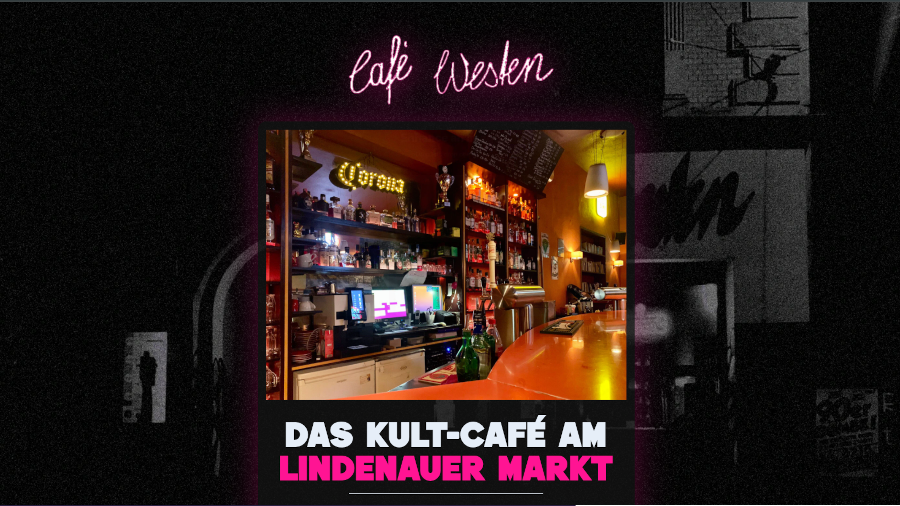

# A simple static bar/restaurant website built with **HTML**, **CSS**, **AlpineJS**, **TypeScript** and **Bun**.

---

## DISCLAIMER
>First of all I think it's important to make it clear that, although Café >Westen is an actual bar/restaurant, I have *not* been asked to, nor >comissioned to, make this website. This was all on my initiative with the >purpose to learn and improve as a developer. I just wanted to use a real >existing website to remake as a project. It's a really cool place, though, >so if you ever find yourself in Leipzig, Germany, make sure you pay [Cafè Westen](https://www.cafe-westen.de/) a visit.

---

## THE PROJECT
### Motivation
I wanted to create a small static site that is fast and light so I wanted to rely mainly on **HTML** and **CSS**. I decided to explore **Bun** in a more active capacity so I run a tiny static server to serve files as well as running Bun as the main bundler and runtime.

For interactivity and client related functionality I decided to go with **AlpineJS** since its only job is toggling accordion panels between an open and closed state, providing responsive images, x-cloak to avoid FOUC, and basic accessibility.

The real Café Westen site uses **Quandoo** as a reservation management solution so I wanted to try and implement a similar widget on my version as well. It was not easy. 

Finally, I want to bring some attention to **Rachel Johnson** and her simple and clean website that inspired my decision to use accordions as navigation. Thanks!

---

## LAYOUT AND DESIGN
In general, I went with an **80's neon light** approach that was a lot of fun to play around with. 

### Fonts
Edges || Geomanist

### Images and videos
Responsive and rendered with lazy-load.
All image editing and logo enhancement done by me using **GIMP**.

## LIGHTHOUSE SCORE
- **Performance:** 90
- **Accessibility:** 100
- **Best practices:** 100
- **SEO:** 91

## DOCUMENTATION AND LINKS

Here is an exhaustive collection of links to all the documentation, inspiration and tech used in this project. Call them footnotes if you will.

- [**Bun.sh**](https://bun.sh/)
- [**Alpinejs.dev**](https://alpinejs.dev/)
- [**Quandoo.de**](https://www.quandoo.de/)
- [**Rachel Johnson**](https://racheljohnson.net/)

If you've got any questions, concerns, or anything else - just contact me at [contact@sonnystark.dev](mailto:contact@sonnystark.dev)

---

This project was built by Sonny Stark || [sonnystark.dev](https://sonnystark.dev)
